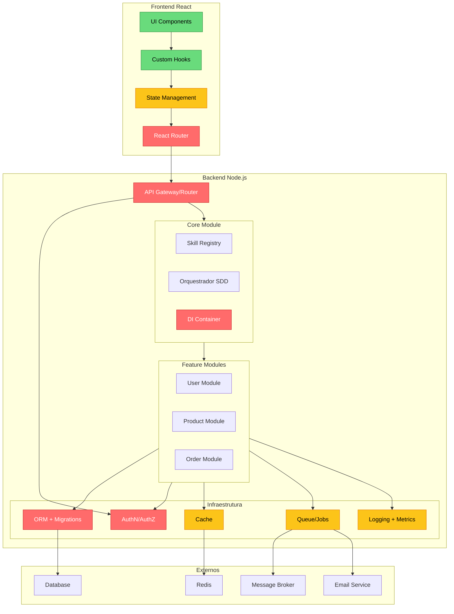
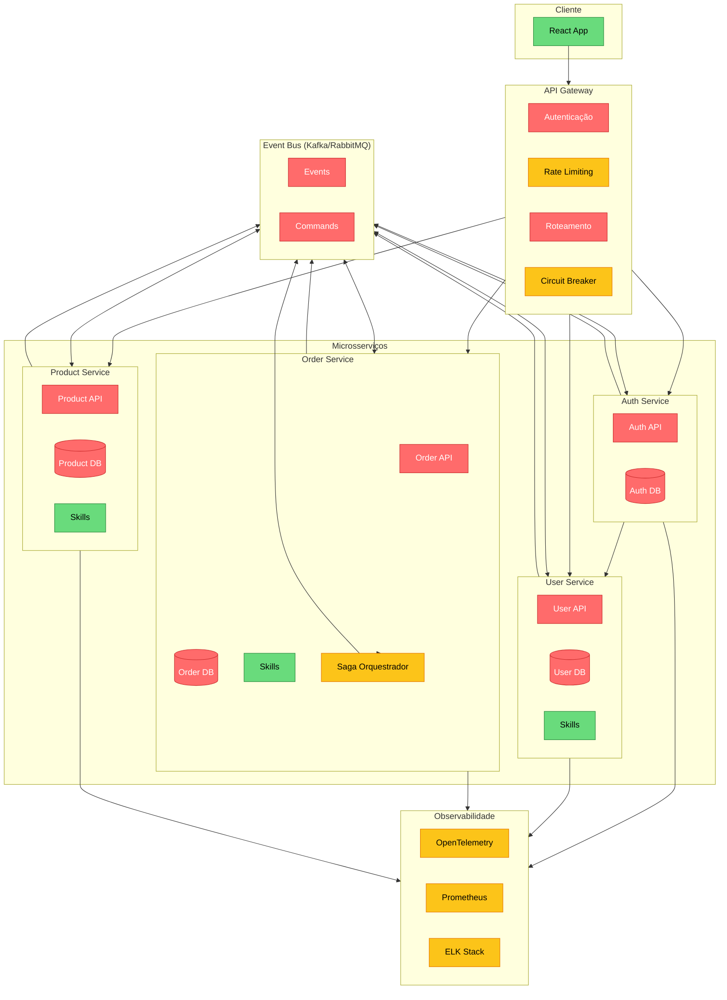
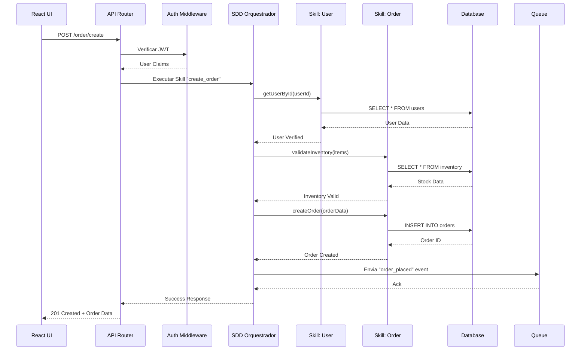
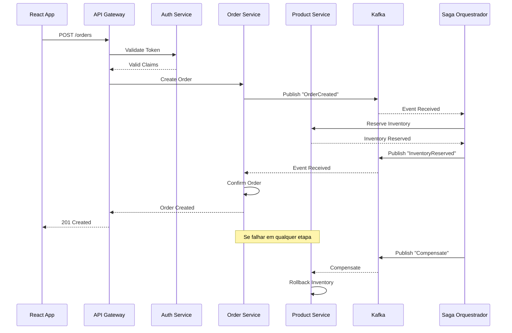

Framework Full-Stack React + Node.js - Listas Abrangentes

Sumário

· Lista 1: Framework Modular Monolítico
· Lista 2: Framework Modular Orientado a Microsserviços
· Diagramas e Fluxos

---

### Lista 1: Framework Modular Monolítico

🔴 Must (Mandatório - Essencial para qualquer aplicação)

Categoria Funcionalidade Detalhamento Ambiguidades Resolvidas
Core Roteamento Frontend: React Router com rotas aninhadas e lazy loading. Backend: Express/Koa com middleware pipeline Roteamento REST vs RPC? Ambos suportados, com preferência por RPC tipado (tRPC) para comunicação full-stack
 Abstração de Banco + Migrations ORM/ODM (Prisma, TypeORM, Mongoose) com sistema de migrations (ex.: prisma migrate) Migrations manuais vs automáticas? Migrations geradas automaticamente a partir de mudanças no schema, com suporte a rollback
 Autenticação + Autorização JWT/Session com múltiplos guards (user/admin), MFA e suporte a OAuth2/Passkeys RBAC vs ABAC? Ambos suportados via políticas declarativas
 Validação de Dados Zod/Yup com validação declarativa, reutilizada entre frontend/backend Validação em qual camada? Validação em ambas: cliente (UX) e servidor (segurança)
 API/RPC Comunicação tRPC ou GraphQL com tipagem compartilhada entre frontend/backend REST vs GraphQL vs tRPC? Framework agnóstico, suporta todos com preferência por tRPC
Infraestrutura Configuração Externalizada Variáveis de ambiente + config files por ambiente (dev/staging/prod) Config em código vs arquivo? Config externalizada em .env e arquivos YAML/JSON
 Logging Estruturado Pino/Winston com níveis (debug/info/error) e output em JSON Log em arquivo vs console? Ambos, com rotação de logs e integração com ferramentas externas
 Tratamento de Erros Global Middleware centralizado com mapeamento de erros para status HTTP Erros de negócio vs técnicos? Categorização com códigos e mensagens amigáveis
 Testes Automatizados Jest/Vitest (unitário), Supertest (integração), Playwright (E2E) O que testar? Framework fornece scaffolding e mocks para todos os tipos
 CLI Comandos: new, generate, migrate, test, build, start CLI minimalista vs completa? Abrangente, com scaffolding de módulos/skills
 Dev Server com Hot-Reload Vite para frontend, nodemon/tsx para backend com reload HMR vs full reload? HMR para frontend, reload para backend
 
🟡 Desejável (Should - Melhoram significativamente a DX e qualidade)

Categoria Funcionalidade Detalhamento Ambiguidades Resolvidas
Infraestrutura Cache Redis/Memcached com abstração unificada, suporte a cache de queries e sessões Cache local vs distribuído? Abstração permite ambos, com fallback
 Queue/Jobs Bull/BullMQ para tarefas assíncronas (envio de emails, processamento de imagens) Jobs síncronos vs assíncronos? Framework incentiva assíncrono com workers separados
 Email/SMS/Notifications Interface unificada para envio (Nodemailer, Twilio, SendGrid) Provedor específico? Interface permite troca de provedor sem mudar código
 Sessão e CSRF Gerenciamento de sessão (redis/banco) com tokens CSRF Stateless vs stateful? Suporte a ambos, com JWT stateless ou sessão stateful
 Internacionalização (i18n) Suporte a múltiplos idiomas com carga dinâmica de traduções Tradução em tempo de build vs runtime? Runtime com cache
 Painel Administrativo Interface admin automática (estilo Django Admin) para CRUD de models Admin para devs vs para usuários? Ambos, com possibilidade de customização
 Data Validation & Serialization Serialização automática de modelos para JSON/XML com transformers Transformação de dados em qual camada? API Resource/Serializer layer
Dev Experience TypeScript First Framework 100% tipado com suporte a ts e tsx JS vs TS? TS é a linguagem primária, com suporte a JS para legado
 ESLint/Prettier Integrados Configurações padrão com possibilidade de override Configurações flexíveis? Sim, com defaults "sane" para equipes
 Docker Integration Dockerfile e docker-compose gerados automaticamente Docker para dev vs prod? Ambos, com configurações específicas

🟢 Possível (Can - Diferenciais competitivos)

Categoria Funcionalidade Detalhamento
Extensibilidade Plugin System Sistema de hooks para adicionar funcionalidades sem modificar o core
Evolução Distributed Evolution Preparação para migrar módulos para microsserviços com mínimo refatoração
UI Generativa CRUD UI Generator Geração automática de interfaces CRUD a partir de modelos
PWA Progressive Web App Service Workers, manifest e offline support
WebSockets Real-time Communication Socket.io integrado para features em tempo real
File Upload Streaming Upload/Download Upload com validação, processamento e storage em S3/local
API Client Generation OpenAPI Client Geração de client HTTP tipados para consumo externo

---

### Lista 2: Framework Modular Orientado a Microsserviços

🔴 Must (Mandatório)

Categoria Funcionalidade Detalhamento Ambiguidades Resolvidas
Core API Gateway Gateway único (Kong/Traefik) com roteamento baseado em path/headers Gateway vs Load Balancer? Gateway inclui roteamento, rate limit e transformação
 Service Discovery Registro dinâmico (Consul/Eureka) com health checks Client-side vs Server-side? Server-side via gateway
 Comunicação Assíncrona Message Broker (Kafka/RabbitMQ) com event-driven architecture Sync vs Async? Framework incentiva async, mas suporta sync via HTTP/gRPC
 Autenticação Centralizada Serviço de Auth com JWT/OAuth2 e propagação de identidade Auth no gateway vs serviço? Gateway valida token, serviços recebem claims
 Dependency Injection/IoC Container DI (como Spring DI) para gerenciar dependências e ciclo de vida DI manual vs automática? Automática com injeção por construtor
 Persistência por Serviço Cada serviço tem seu próprio banco, sem compartilhamento Banco compartilhado vs por serviço? Por serviço (Database-per-Service)
 Resiliência Circuit Breaker, Retry, Timeout, Bulkhead (Resilience4j) Aplicado em qual camada? HTTP Client e Message Consumer
Infraestrutura Observabilidade Distribuída OpenTelemetry com tracing, métricas e logs correlacionados Como correlacionar? Headers de trace propagados entre serviços
 Config Externalizada Config Server (Spring Cloud Config) ou HashiCorp Vault Config centralizada vs por serviço? Centralizada com sobreposição por serviço
 Deploy Independente CI/CD pipelines independentes por serviço Deploy paralelo vs sequencial? Paralelo, com contratos de compatibilidade
 Contract Testing Pact/CDC para validar comunicação entre serviços Testes de integração vs contrato? Ambos, com prioridade para contract tests
 Edge/Circuit Breaking Resiliência implementada no cliente HTTP e no gateway Gateway faz circuit break? Sim, complementar ao cliente
 Health Checks Endpoints /health, /ready, /live para orquestradores Probes do Kubernetes? Padronizadas para liveness/readiness
Dev Experience Monorepo com Turborepo/Nx Código fonte de todos serviços em um único repositório Monorepo vs polyrepo? Monorepo com ferramentas para build inteligente
 TypeScript Full-Stack Todos os serviços em TS com compartilhamento de tipos JS vs TS? TS obrigatório para todos os serviços

🟡 Desejável (Should)

Categoria Funcionalidade Detalhamento Ambiguidades Resolvidas
Padrões CQRS Separação de comandos (escrita) e queries (leitura) com modelos distintos CQRS com Event Sourcing ou sem? Opcional, framework suporta ambos
 Event Sourcing Armazenamento de eventos imutáveis como fonte de verdade Event Store vs Banco relacional? Framework suporta EventStoreDB e também abstrações
 Saga/Orquestração Coreografia ou orquestração para transações distribuidas Coreografia vs Orquestração? Framework suporta ambos, com preferência por coreografia
Infraestrutura Embedded Servers Servidor HTTP embutido (Fastify/Express) na aplicação Embedded vs External? Embedded para desenvolvimento e produção (como Spring Boot)
 Compilação AOT/Build-time Otimizações em tempo de build para startup rápido (como Quarkus) Interpretado vs Compilado? Compilado com TS para JS, com otimizações
 Dev Services Auto-provisionamento de infra (banco, message broker) em containers Docker manual vs automatizado? Automatizado pelo framework em dev
 Live Reload Recarga automática de serviços em desenvolvimento Hot reload vs full restart? Hot reload para código, restart para configurações
 Continuous Testing Testes executados em background durante desenvolvimento Testes manuais vs automáticos? Automáticos, com feedback imediato
Dev Experience OpenAPI Generation Geração automática de especificação OpenAPI (ou AsyncAPI) OpenAPI vs gRPC reflection? Ambos, conforme protocolo
 API Versioning Suporte a versionamento de APIs (URL path ou header) Versionamento no path vs header? Ambos, configurável

🟢 Possível (Can)

Categoria Funcionalidade Detalhamento
Integração MCP (Model Context Protocol) Expor serviços como servidores MCP para agentes de IA
Evolução Independent Model Evolution Mecanismos para evoluir contratos de API sem quebrar consumidores
Deploy Single-File Applications Empacotar aplicação em um único arquivo (microservice)
Orquestração Kubernetes Native Manifests K8s gerados automaticamente, com suporte a Helm
UI UI Generation from Contracts Gerar interfaces React a partir de contratos de API
Integração External API Consumption Mecanismos para consumir APIs externas de forma tipada
Resiliência Chaos Engineering Ferramentas para testar resiliência (injeção de falhas)

---

### Diagramas e Fluxos

#### Diagrama 1: Arquitetura Monolítica Modular (SDD)

#### Diagrama 2: Arquitetura de Microsserviços (SDD)

### Fluxo 1: Orquestração SDD em Monólito

Fluxo 2: Comunicação Assíncrona entre Microsserviços

Tabela de Decisão: Quando usar cada arquitetura

Critério Monolítico Modular Microsserviços
Time Size < 10 devs 20 devs
Deploy Frequency Diário/Semanal Múltiplas vezes ao dia
Team Structure Único time Múltiplos times autônomos
Technology Diversity Baixa (Node.js) Alta (Node.js, Python, Go)
Critical Latency Alta (comunicação in-process) Baixa (Rede adiciona latência)
Data Consistency ACID fácil Eventual consistency
Startup Complexity Baixa Alta
Operational Overhead Baixo Alto (observabilidade, deploy)