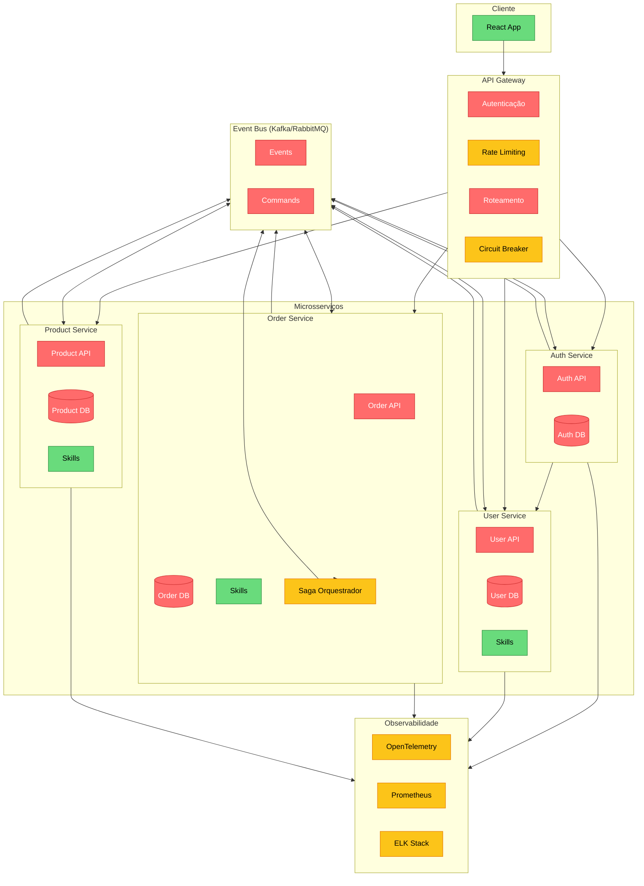
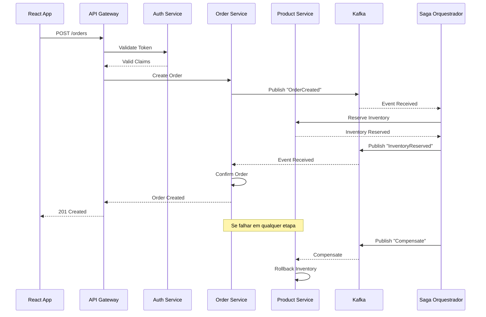

# Framework Full-Stack React + Node.js - Listas Abrangentes

## Sumário
- [Lista: Framework Modular Orientado a Microsserviços](#lista-framework-modular-orientado-a-microsserviços)
- [Diagramas e Fluxos](#diagramas-e-fluxos)

---

## Lista: Framework Modular Orientado a Microsserviços

### 🔴 Must (Mandatório)

| Categoria | Funcionalidade | Detalhamento | Ambiguidades Resolvidas |
| :--- | :--- | :--- | :--- |
| **Core** | **API Gateway** | Gateway único (Kong/Traefik) com roteamento baseado em path/headers | *Gateway vs Load Balancer?* Gateway inclui roteamento, rate limit e transformação |
| | **Service Discovery** | Registro dinâmico (Consul/Eureka) com health checks | *Client-side vs Server-side?* Server-side via gateway |
| | **Comunicação Assíncrona** | Message Broker (Kafka/RabbitMQ) com event-driven architecture | *Sync vs Async?* Framework incentiva async, mas suporta sync via HTTP/gRPC |
| | **Autenticação Centralizada** | Serviço de Auth com JWT/OAuth2 e propagação de identidade | *Auth no gateway vs serviço?* Gateway valida token, serviços recebem claims |
| | **Dependency Injection/IoC** | Container DI (como Spring DI) para gerenciar dependências e ciclo de vida | *DI manual vs automática?* Automática com injeção por construtor |
| | **Persistência por Serviço** | Cada serviço tem seu próprio banco, sem compartilhamento | *Banco compartilhado vs por serviço?* Por serviço (Database-per-Service) |
| | **Resiliência** | Circuit Breaker, Retry, Timeout, Bulkhead (Resilience4j) | *Aplicado em qual camada?* HTTP Client e Message Consumer |
| **Infraestrutura** | **Observabilidade Distribuída** | OpenTelemetry com tracing, métricas e logs correlacionados | *Como correlacionar?* Headers de trace propagados entre serviços |
| | **Config Externalizada** | Config Server (Spring Cloud Config) ou HashiCorp Vault | *Config centralizada vs por serviço?* Centralizada com sobreposição por serviço |
| | **Deploy Independente** | CI/CD pipelines independentes por serviço | *Deploy paralelo vs sequencial?* Paralelo, com contratos de compatibilidade |
| | **Contract Testing** | Pact/CDC para validar comunicação entre serviços | *Testes de integração vs contrato?* Ambos, com prioridade para contract tests |
| | **Edge/Circuit Breaking** | Resiliência implementada no cliente HTTP e no gateway | *Gateway faz circuit break?* Sim, complementar ao cliente |
| | **Health Checks** | Endpoints `/health`, `/ready`, `/live` para orquestradores | *Probes do Kubernetes?* Padronizadas para liveness/readiness |
| **Dev Experience** | **Monorepo com Turborepo/Nx** | Código fonte de todos serviços em um único repositório | *Monorepo vs polyrepo?* Monorepo com ferramentas para build inteligente |
| | **TypeScript Full-Stack** | Todos os serviços em TS com compartilhamento de tipos | *JS vs TS?* TS obrigatório para todos os serviços |

### 🟡 Desejável (Should)

| Categoria | Funcionalidade | Detalhamento | Ambiguidades Resolvidas |
| :--- | :--- | :--- | :--- |
| **Padrões** | **CQRS** | Separação de comandos (escrita) e queries (leitura) com modelos distintos | *CQRS com Event Sourcing ou sem?* Opcional, framework suporta ambos |
| | **Event Sourcing** | Armazenamento de eventos imutáveis como fonte de verdade | *Event Store vs Banco relacional?* Framework suporta EventStoreDB e também abstrações |
| | **Saga/Orquestração** | Coreografia ou orquestração para transações distribuidas | *Coreografia vs Orquestração?* Framework suporta ambos, com preferência por coreografia |
| **Infraestrutura** | **Embedded Servers** | Servidor HTTP embutido (Fastify/Express) na aplicação | *Embedded vs External?* Embedded para desenvolvimento e produção (como Spring Boot) |
| | **Compilação AOT/Build-time** | Otimizações em tempo de build para startup rápido (como Quarkus) | *Interpretado vs Compilado?* Compilado com TS para JS, com otimizações |
| | **Dev Services** | Auto-provisionamento de infra (banco, message broker) em containers | *Docker manual vs automatizado?* Automatizado pelo framework em dev |
| | **Live Reload** | Recarga automática de serviços em desenvolvimento | *Hot reload vs full restart?* Hot reload para código, restart para configurações |
| | **Continuous Testing** | Testes executados em background durante desenvolvimento | *Testes manuais vs automáticos?* Automáticos, com feedback imediato |
| **Dev Experience** | **OpenAPI Generation** | Geração automática de especificação OpenAPI (ou AsyncAPI) | *OpenAPI vs gRPC reflection?* Ambos, conforme protocolo |
| | **API Versioning** | Suporte a versionamento de APIs (URL path ou header) | *Versionamento no path vs header?* Ambos, configurável |

### 🟢 Possível (Can)

| Categoria | Funcionalidade | Detalhamento |
| :--- | :--- | :--- |
| **Integração** | **MCP (Model Context Protocol)** | Expor serviços como servidores MCP para agentes de IA |
| **Evolução** | **Independent Model Evolution** | Mecanismos para evoluir contratos de API sem quebrar consumidores |
| **Deploy** | **Single-File Applications** | Empacotar aplicação em um único arquivo (microservice) |
| **Orquestração** | **Kubernetes Native** | Manifests K8s gerados automaticamente, com suporte a Helm |
| **UI** | **UI Generation from Contracts** | Gerar interfaces React a partir de contratos de API |
| **Integração** | **External API Consumption** | Mecanismos para consumir APIs externas de forma tipada |
| **Resiliência** | **Chaos Engineering** | Ferramentas para testar resiliência (injeção de falhas) |

---

## Diagramas e Fluxos

### Diagrama: Arquitetura de Microsserviços (SDD)

### Fluxo: Comunicação Assíncrona entre Microsserviços

