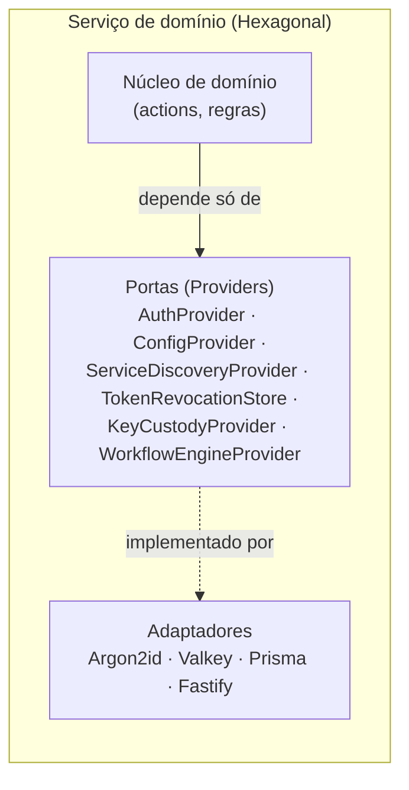
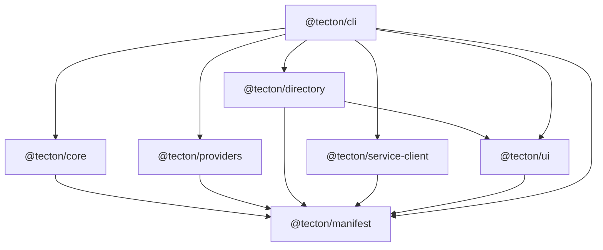
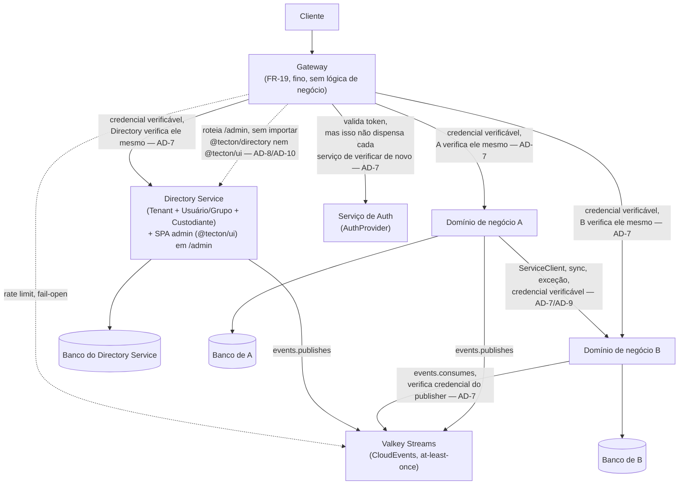

# Architecture Spine — Tecton

## Design Paradigm

**DOMA (Domain-Oriented Microservice Architecture)** no nível macro: cada domínio (embutido ou de terceiros) é um bounded context com manifest, banco e ciclo de vida próprios — o vocabulário do PRD ("domínio", "persistência por serviço") já é DOMA sem o nome formal.

**Hexagonal / Ports-and-Adapters** por serviço no nível micro: o núcleo de domínio (actions, regras de negócio) nunca importa uma implementação concreta de infraestrutura — só os Providers (portas). Adaptadores concretos (Argon2id, Valkey, Prisma, Fastify) ficam na borda.



## Invariants & Rules

### AD-1 — DOMA + Hexagonal como paradigma vinculante
- **Binds:** todas as features (`all`)
- **Prevents:** um domínio novo inventando sua própria camada de acesso a infraestrutura, divergindo do resto
- **Rule:** todo serviço de domínio organiza seu código em núcleo (domínio) + portas (interfaces de Provider) + adaptadores (implementações concretas); o núcleo nunca importa um pacote de infraestrutura concreta diretamente.

### AD-2 — Core de Diretório é serviço próprio, pré-construído [ADOPTED]
- **Binds:** FR-6, FR-7, FR-8, FR-9, FR-10, FR-11
- **Prevents:** o dev editando lógica interna do Directory Service, ou a árvore unificada se fragmentando em três bancos separados; um domínio de negócio lendo o banco do Directory Service diretamente pra evitar uma chamada (ver AD-9)
- **Rule:** Tenant, Usuário/Grupo e Custodiante vivem sempre dentro do pacote `@tecton/directory`, distribuído como serviço pronto/configurável (nunca via `tecton-admin generate domain`); customização só por `objectClass.attributes` declarativo. É a única exceção à regra de persistência-por-serviço em si (AD-9), mas não é exceção ao *acesso* — um domínio que precisa de dado do Directory localmente consome via `events.publishes` do Directory (AD-9), nunca lê o banco dele diretamente.

**Mecanismo de armazenamento dos atributos declarativos [ADOPTED]:** `objectClass.attributes` persiste como bag de atributos JSON/JSONB por objeto, validado contra o JSON Schema do `objectClass` em tempo de escrita pelo próprio Directory Service — nunca gera migração de schema relacional disparada por manifest de terceiros. Mesmo padrão do LDAP/Active Directory que inspirou o core. Trade-off aceito conscientemente: unicidade/FK/index reais não são garantidos pelo banco nesses atributos, só validação de aplicação — se um domínio precisar de constraint forte sobre um atributo customizado, isso é sinal de que o atributo pertence a um domínio de negócio próprio, não ao Directory Service.

### AD-3 — Direção de dependência entre pacotes do framework [ADOPTED]
- **Binds:** `@tecton/*` (`manifest`, `core`, `providers`, `directory`, `service-client`, `ui`, `cli`)
- **Prevents:** dependência circular entre pacotes do próprio framework
- **Rule:** `@tecton/manifest` não depende de nenhum outro pacote Tecton; `core`, `providers`, `service-client` e `ui` podem depender de `manifest`; `directory` pode depender de `manifest` e de `ui` (única dependência entre pacotes-irmãos da spine, pela SPA administrativa embutida — AD-10); `cli` pode depender de todos; nunca o inverso.



### AD-4 — Código gerado importa, nunca copia
- **Binds:** `all` (qualquer saída de `tecton-admin new`/`generate`)
- **Prevents:** drift entre o framework atualizado e código do framework já copiado/editado no repo do dev
- **Rule:** todo scaffold gerado declara `@tecton/*` como dependência versionada em `package.json`; nenhum comando do CLI grava código-fonte de pacote do framework dentro do repo do dev.

### AD-5 — UUID v7 como formato canônico de ID [ADOPTED]
- **Binds:** `all` (toda entidade persistida, campo `id` do envelope CloudEvents)
- **Prevents:** um domínio usando inteiro auto-incremento e outro UUID quebrando referência cross-domínio; ou dois serviços gerando UUID v7 com codificação/biblioteca diferentes, quebrando a ordenação por tempo que é o próprio motivo de escolher v7
- **Rule:** todo identificador de entidade e todo `id` de evento é uma string UUID v7 na forma canônica (36 caracteres, minúsculas, `8-4-4-4-12`), gerada por biblioteca padrão do ecossistema (`crypto.randomUUID`-equivalente ou `uuid`/`uuidv7` mantidas) — nunca implementação própria do algoritmo.

### AD-6 — i18n como terceiro eixo de idioma [ADOPTED]
- **Binds:** FR-8, FR-24, qualquer texto exposto ao usuário final de um sistema gerado
- **Prevents:** string de UI ou de erro hardcoded num único idioma, ou `type` do RFC 9457 variando por idioma (perdendo estabilidade de máquina)
- **Rule:** todo texto voltado a usuário final usa chave de catálogo i18n (nunca literal solto); `type` do RFC 9457 é sempre uma URI neutra de idioma; `title`/`detail` são negociados por `Accept-Language`, com `i18nKey` como extensão pra lookup de máquina. CLI, logs internos e comentários de código ficam fora desse eixo — inglês, sempre (Constitution §8, eixo 2).

### AD-7 — Zero Trust verificado em toda borda, sem exceção
- **Binds:** `all` (toda chamada serviço-a-serviço, síncrona ou assíncrona)
- **Prevents:** um serviço confiando num header pré-decodificado ou numa credencial de evento sem verificação própria; ou verificando a assinatura mas ainda assim decidindo autorização com base num claim repassado por outro serviço, reabrindo o mesmo buraco por outra porta (confused deputy)
- **Rule:** todo serviço (incluindo o Directory Service) verifica a assinatura do token/credencial ele mesmo, sempre, e toma toda decisão de autorização exclusivamente a partir das claims que ele mesmo extraiu dessa verificação — nunca de um claim/header repassado por outro serviço, mesmo que a chamada de origem já tenha sido autenticada (Constitution §9).

### AD-8 — Gateway fino, com allowlist executável
- **Binds:** FR-19
- **Prevents:** o gateway (código gerado, editável pelo dev — ao contrário dos pacotes `@tecton/*`) acumulando lógica de negócio, cache ou circuit breaker aos poucos, sem que ninguém decida isso explicitamente
- **Rule:** o gateway nunca importa um pacote de circuit breaker, cache de resposta, ou qualquer pacote de domínio específico — `tecton-admin lint:gateway` verifica isso a cada build/CI, é a única AD desta spine com enforcement automatizado citado no próprio PRD (FR-19).

### AD-9 — Isolamento de domínio: nunca DB nem código de outro domínio
- **Binds:** `all` (todo domínio de negócio gerado, incluindo o Directory Service como publisher)
- **Prevents:** um domínio importando o código-fonte ou lendo diretamente o banco de outro domínio pra "economizar uma chamada" — furando tanto a regra de persistência-por-serviço quanto a fronteira de pacote que a AD-3 só cobre pra `@tecton/*`
- **Rule:** o único jeito de um domínio A obter dado de um domínio B é (1) chamada síncrona via `ServiceClient` gerado a partir de `dependencies` (exceção, FR-26), ou (2) consumir `events.publishes` de B e manter modelo de leitura local (padrão, FR-4/FR-21) — nunca import direto de código nem acesso direto ao banco de outro domínio, Directory Service incluído.

### AD-10 — `@tecton/ui`: runtime compartilhado de frontend, fronteira única do lado React
- **Binds:** FR-8, FR-24 (parte de UI), qualquer superfície de tela do framework
- **Prevents:** cada domínio reimplementando o binding schema→formulário (`@rjsf/core`, projeto react-jsonschema-form sob o namespace ativo `@rjsf`) ou o tratamento de `i18nKey` à sua maneira; colisão de namespace de `i18nKey` entre domínios (achado H5 da revisão adversarial anterior); a spine tratando o lado React do produto como um detalhe de stack em vez de uma fronteira arquitetural — apesar do Tecton ser definido como framework full-stack React.js + Node.js desde o Brief
- **Rule:**
  - `@tecton/ui` é o único runtime que sabe transformar um schema de manifest em tela. Todo consumidor importa, nenhum reimplementa. **Instância única:** dentro de um mesmo app rodando (a SPA admin do Directory, ou uma UI de domínio de negócio), `@tecton/ui` é montado como singleton — um único `Core`/catálogo de i18n consolidado; múltiplas telas ou módulos consomem essa mesma instância, nenhum cria a sua própria (fecha H10: dois módulos com dois `Core`s isolados reabririam a colisão de `i18nKey` que a regra de namespace existe pra evitar).
  - **Camada 0 (default):** tema completo como CSS custom properties (paleta, tipografia, espaçamento, radius) já ligado aos templates/widgets do `@rjsf/core` (projeto react-jsonschema-form sob o namespace ativo `@rjsf` — o pacote `react-jsonschema-form` original no npm está abandonado desde 2019). Customização de identidade visual é só sobrescrever tokens — nunca exige escrever componente. Os nomes de custom property exportados são superfície pública versionada por semver — renomear um token é breaking change (major version), mesma disciplina que AD-4 já exige de qualquer pacote `@tecton/*` (fecha H14: sem isso, um consumidor bundlado/co-versionado e um consumidor externo por import opcional divergiam silenciosamente a cada release).
  - **Camada 1 (escape hatch):** porta `UiThemeProvider` — registro de slots de componente (`ObjectTreeView`, `AttributeForm`, `ScreenLayout`) substituíveis um a um; o que não for substituído cai no default da Camada 0. O núcleo (binding schema→form, resolução de i18n, chamada `ServiceClient`) nunca depende da implementação visual concreta, só da porta — mesmo padrão Hexagonal já aplicado a `AuthProvider`/`ConfigProvider` (AD-1). **Composição:** o `Core` resolve os três slots via a porta e injeta os já-resolvidos como filhos em `ScreenLayout` — um `ScreenLayout` customizado nunca resolve `ObjectTreeView`/`AttributeForm` por conta própria nem os reimplementa inline; só recebe e posiciona o que o `Core` já montou (fecha H11: sem essa regra de composição, um slot substituído podia contornar o registro e divergir do comportamento dos outros dois).
  - **Namespace de `i18nKey`** é obrigatório na forma `<domínio>.<chave>` (ex. `directory.tenant.error.notFound`, com sub-namespace por objectClass embutido quando mais de um vive no mesmo pacote — Tenant/Usuário-Grupo/Custodiante dentro de `@tecton/directory`), reforçado no ponto único de catálogo consolidado da instância singleton acima. Fecha H5 e a variante dele dentro do próprio Directory.
  - **Escopo, herdado do PRD (Glossário §3):** `objectClass` — e com ele, especificamente o slot `ObjectTreeView` (containment + ACL herdável, que depende do modelo de dados do Directory) — é exclusivo de Tenant/Usuário-Grupo/Custodiante; nenhum domínio de terceiros o declara no MVP, e `tecton-admin generate domain` continua 100% backend, sem scaffold de frontend algum. Isso **não** restringe o slot `AttributeForm` (binding schema→formulário genérico, sem containment/ACL): um domínio de negócio pode importar `@tecton/ui` e apontar o `Core` pro JSON Schema do próprio `tecton.yaml` pra gerar formulário — é reuso legítimo do renderer, não uma segunda árvore de Diretório (fecha H15: o que é exclusivo do Directory é a semântica hierárquica de `ObjectTreeView`, não o binding genérico de formulário). Nesse reuso, o domínio de negócio importa só `@tecton/ui` e `@tecton/manifest` (que já define os tipos de schema) — **nunca `@tecton/directory` diretamente**, nem para tipagem: `@tecton/directory` não exporta nenhum tipo de `objectClass` para reuso externo, e código de domínio importando dele conta como "outro domínio" sob AD-9, `@tecton/directory` incluído mesmo sendo pacote do framework (fecha H12).
  - **Hospedagem:** a SPA administrativa do Directory Service (construída sobre `@tecton/ui`) é empacotada dentro do próprio `@tecton/directory` e servida por ele mesmo (assets estáticos via Fastify) num path dedicado (`/admin`). O Gateway só roteia pra esse path a partir do manifest (AD-8/FR-19) — nunca importa `@tecton/directory` nem `@tecton/ui`. **Toda chamada de API da SPA — não só o carregamento inicial do shell/assets — atravessa o Gateway como qualquer outro cliente**; a SPA nunca fala direto com o host interno do Directory Service, mesmo sendo servida por ele, pra não perder rate-limit/postura Zero Trust de primeira linha no tráfego mais sensível do sistema (fecha H13). `tecton-admin dev` sobe essa UI junto, sem passo manual do dev.

## Consistency Conventions

| Concern | Convention |
| --- | --- |
| Naming (pacotes, arquivos) | Pacotes `@tecton/<nome>` kebab-case; pastas de domínio `domains/<nome>` kebab-case; classes TS `PascalCase`, funções/variáveis `camelCase`, arquivos `kebab-case` — convenção padrão do ecossistema Node/TS, sem invenção própria. Todo identificador em **inglês**, sem exceção (Constitution §8, eixo 2) — mesmo quando o `<nome>` do domínio em si vem de um conceito de negócio em português. |
| Naming (eventos) | `type` do CloudEvents em reverse-DNS: `com.tecton.<domínio>.<evento>` (ex.: `com.tecton.tenant.exported`) |
| Data & formats (ids) | UUID v7 (AD-5) |
| Data & formats (datas) | ISO 8601 em UTC, sem exceção |
| Data & formats (erro) | RFC 9457 Problem Details (FR-24), multi-idioma (AD-6) |
| Data & formats (envelope de evento) | CloudEvents sobre Valkey Streams (FR-4/FR-21) |
| Data & formats (sucesso) | Payload puro do `output`, sem envelope (FR-23) |
| State & mutação | Persistência por serviço (FR geral), exceto Directory Service (AD-2); nunca acesso direto a banco de outro domínio |
| Cross-cutting (auth) | JWT verificado por serviço, sempre (FR-13, AD-7) |
| Cross-cutting (config) | Env vars + validação tipada, fail-fast no startup (FR-22) |
| Cross-cutting (log interno) | Inglês, sempre (Constitution §8, eixo 2) |
| Cross-cutting (mensagem exposta) | i18n, PT-BR padrão + EN secundário (AD-6); `i18nKey` namespaced `<domínio>.<chave>` (AD-10) |
| Frontend (tema) | CSS custom properties como default; override seletivo via porta `UiThemeProvider` (AD-10) |

## Stack

| Nome | Versão |
| --- | --- |
| Node.js | 24.x (Active LTS, suportado até abr/2028) |
| TypeScript | 6.0.3 (não 7.0 — sem API pública de compilador até a 7.1, ~out/2026; `ts-node`/`tsx` dependem dela. Revisitar na 7.1) |
| Fastify | 5.12.x |
| Prisma | 8.x (GA em 28/08/2026, TypeScript puro sem engine Rust — mesmo racional que já valia pro 7.x, agora na versão atual) |
| Valkey | 9.1.x (fork Linux Foundation, compatível com clientes `ioredis`/`node-redis`) |
| React | 19.x — **verificar patch exato no início da implementação** (ecossistema muda rápido, não travar agora) |
| OpenTelemetry | SDK Node atual, instrumentação automática de Fastify/Prisma — observabilidade distribuída já é escopo do MVP (PRD §6.1) |
| Awilix | container de DI/IoC leve por serviço (PRD §6.1) — resolve Providers como dependências injetadas, não singletons globais |
| Testcontainers | isolamento de `test:contracts`/CI (FR-31) — containers efêmeros descartados por execução, contexto diferente do Dev Services (FR-30) |
| PostgreSQL / MySQL / MS-SQL | conforme escolha do dev, via Prisma |

## Structural Seed

```text
tecton/                          # repositório do próprio framework (pnpm workspaces, sem Turborepo/Nx aqui)
  packages/
    manifest/                    # @tecton/manifest — schema, parser, validador de tecton.yaml
    core/                        # @tecton/core — geração de rota Fastify, conector CloudEvents/Valkey Streams, formato de resposta
    providers/                   # @tecton/providers — interfaces de Provider + implementações de referência
    directory/                   # @tecton/directory — Directory Service pronto (Tenant + Usuário/Grupo + Custodiante) + SPA admin embutida (/admin, AD-10)
    service-client/              # @tecton/service-client — gerador do ServiceClient
    ui/                          # @tecton/ui — runtime de frontend: binding @rjsf/core, tema (tokens CSS + porta UiThemeProvider), i18nKey (AD-10)
    cli/                         # @tecton/cli — binário tecton-admin
```

```text
{app-do-dev}/                    # scaffold gerado por `tecton-admin new` (Turborepo/Nx aqui, per PRD §6.1)
  apps/
    gateway/                     # gerado por new — roteamento fino (FR-19), nunca lógica de negócio
    directory/                   # instância configurada do @tecton/directory (AD-2)
    domains/
      <nome-do-domínio>/         # um por `generate domain` — dono do próprio banco (Prisma)
        tecton.yaml               # manifest declarativo do domínio
  docker-compose.dev.yml         # Dev Services: Valkey + banco (FR-30)
```



*Nenhuma seta acima é "confiar" — toda seta rotulada com AD-7 significa que o serviço de destino verifica a credencial por conta própria, mesmo que o Gateway já tenha validado antes. A validação do Gateway é a primeira linha, não a única (FR-13).*

## Capability → Architecture Map

| Feature (PRD §4) | Lives in | Governed by |
| --- | --- | --- |
| 4.1 Manifest Declarativo | `@tecton/manifest` | AD-3 |
| 4.2 Core de Diretório | `@tecton/directory` (backend) + `@tecton/ui` (telas, FR-8) | AD-2, AD-10 |
| 4.3 Domínios Embutidos | `@tecton/directory` | AD-2 |
| 4.4 Autenticação e Zero Trust | `@tecton/providers` (AuthProvider, TokenRevocationStore) | AD-7 |
| 4.5 CLI | `@tecton/cli` | AD-3, AD-4 |
| 4.6 Interoperabilidade | `@tecton/core` (gateway/discovery/mensageria), `@tecton/providers` (ConfigProvider) | AD-8 (gateway fino), AD-9 (isolamento de domínio), Consistency Conventions |
| 4.7 Formato de Resposta de API | `@tecton/core` | AD-6, Consistency Conventions |
| 4.8 Resiliência e Operação | `@tecton/service-client`, geração de Dockerfile no `cli` | AD-1 (adaptador plugável no `ServiceClient`) |
| 4.9 Evolução de Contrato | `@tecton/manifest` (`test:contracts`) | — |
| 4.10 Developer Experience | `@tecton/cli` (Dev Services, Testcontainers) | — |

## Deferred

- **Orquestração de deploy além do Dockerfile por domínio** (Kubernetes, pipeline de release independente) — PRD §6.2 já trata como roadmap explícito; esta spine não antecipa mecanismo.
- **Topologia física do banco por serviço** (mesma instância de servidor com bancos lógicos separados vs. servidores físicos separados) — decisão operacional, revisitar no momento de deploy real (não muda o código).
- **Implementação real do `KeyCustodyProvider`** (integração OpenBAO) — PRD roadmap; a interface e a exigência de interceptação no nível de dado (FR-11) já estão fixadas.
- **Implementação real do `WorkflowEngineProvider`** (candidato Temporal) — PRD roadmap.
- **Hospedagem do MCP por domínio** — PRD roadmap (Open Question §9-3).
- **Versão exata de patch do React** — verificar no início real da implementação, não travar numa spine que pode ficar desatualizada rápido. Verificado em 2026-09-02: `@rjsf/core` v6.1.2 declara peer dependency `react >=18` (sem teto), compatibilidade explícita com React 19 ainda não formalmente anunciada pelo mantenedor apesar de relatos de uso sem problemas — reconfirmar no início da implementação.
- **Circuit breaker/bulkhead no `ServiceClient`** (candidato `opossum`) — PRD roadmap; AD-1/hexagonal já garante que isso entra como adaptador plugável sem reforma.
- **Ferramenta de build/bundling da SPA de `@tecton/ui`** (Vite vs. alternativas) — verificar no início real da implementação; AD-10 fixa a fronteira de pacote e o contrato da porta `UiThemeProvider`, não a ferramenta de bundling.
- **Catálogo/temas visuais alternativos prontos** (além do default de `@tecton/ui`) — roadmap; MVP entrega só o tema default (Camada 0 da AD-10) e a porta de override (Camada 1), não uma biblioteca de temas alternativos.
