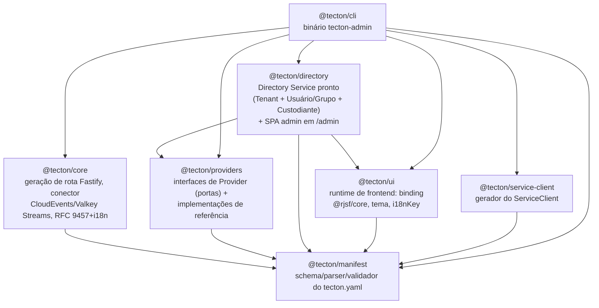
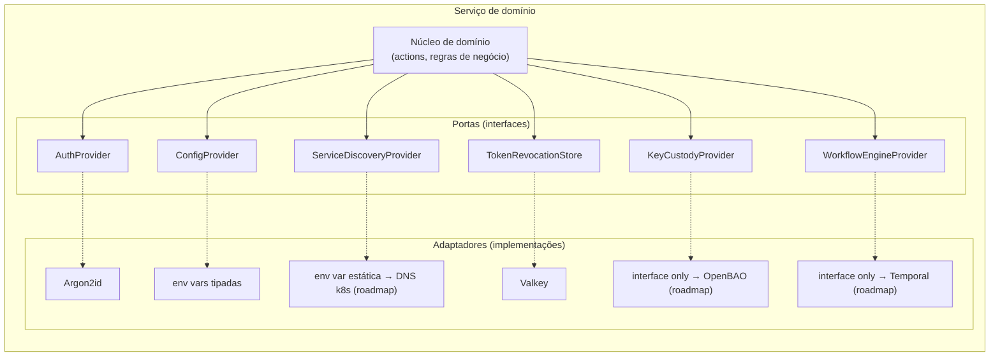
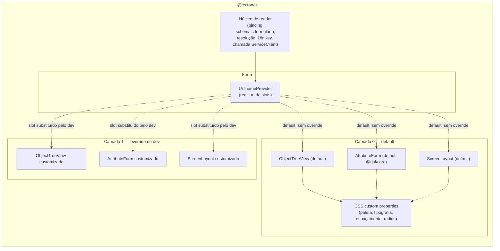
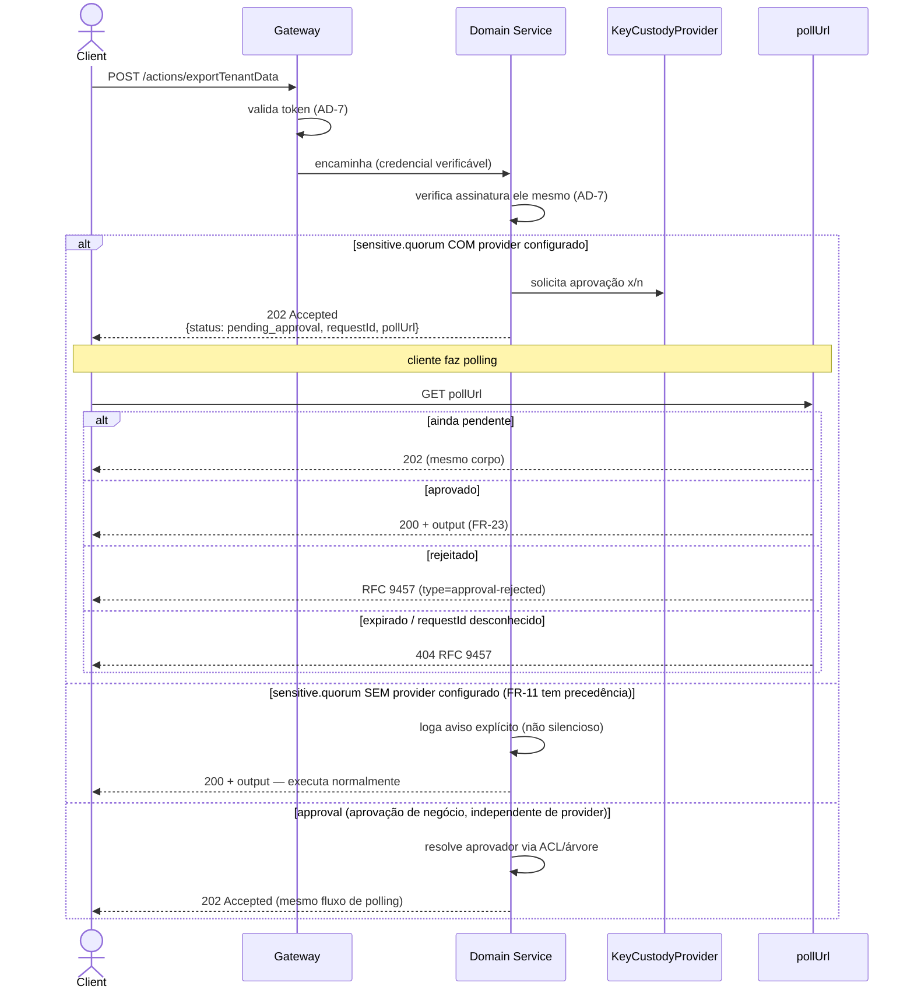
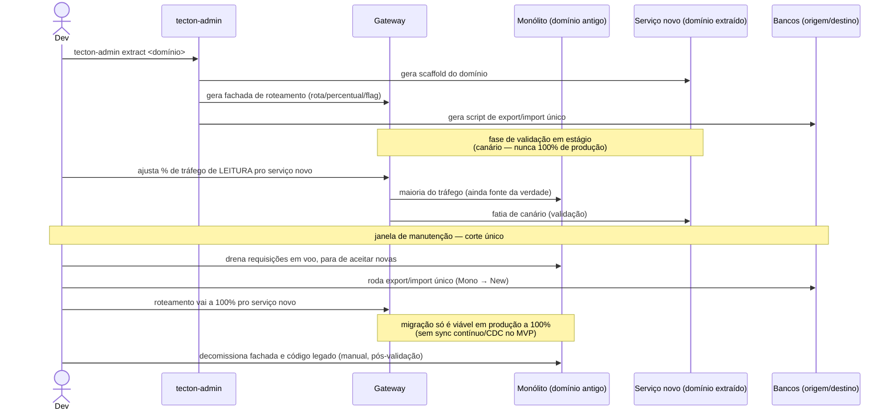
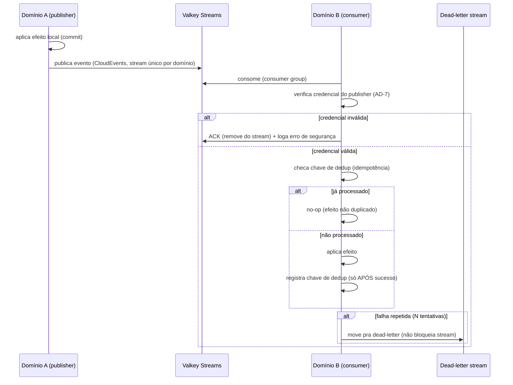
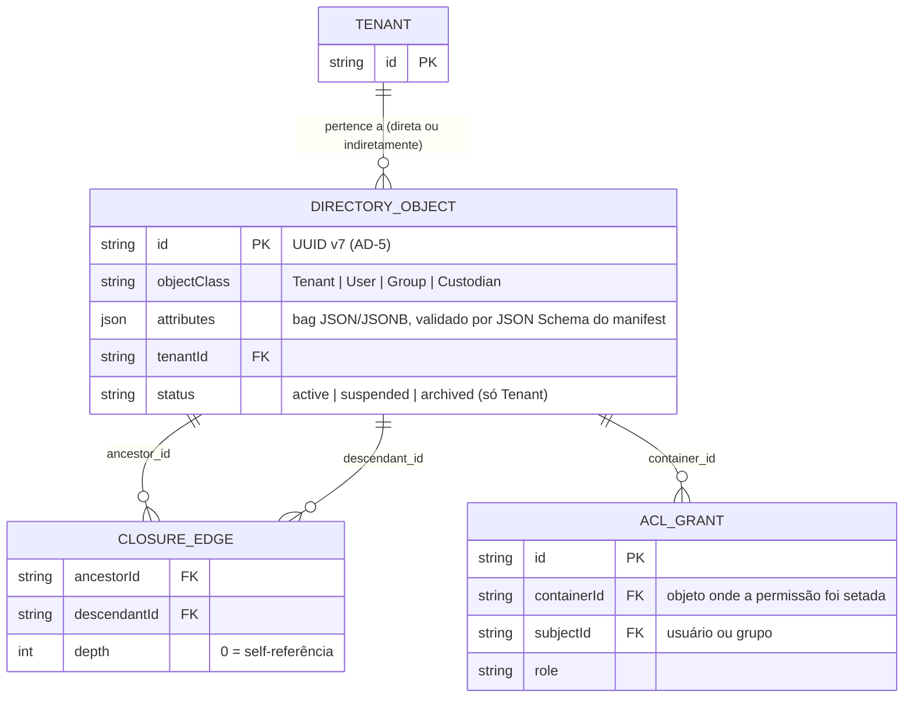

# UML — Tecton

Diagramas complementares à [ARCHITECTURE-SPINE.md](ARCHITECTURE-SPINE.md). A spine fixa os invariantes (ADs); este documento mostra a forma — componentes, fluxos críticos e o modelo de dados do Core de Diretório. Renderiza nativamente em qualquer visualizador Markdown com suporte a Mermaid (GitHub incluso).

## 1. Componentes

### 1.1 Pacotes do framework (repositório `tecton`)



*Regra de dependência (AD-3): `manifest` nunca depende de nada interno; `core`/`providers`/`service-client`/`ui` podem depender de `manifest`; `directory` pode depender de `manifest` e de `ui` (única dependência entre pacotes-irmãos, pela SPA admin embutida — AD-10); `cli` depende de todos; nunca o inverso.*

### 1.2 Sistema em runtime (app gerada por `tecton-admin new`)

```mermaid
graph TB
    Client["Cliente"] --> Gateway["Gateway<br/>(FR-19, fino — AD-8)"]
    Gateway -.->|roteia /admin, sem importar<br/>@tecton/directory nem @tecton/ui — AD-10| Directory
    Gateway -->|valida token (1ª linha,<br/>não a única — FR-13)| AuthSvc["Serviço de Auth<br/>(AuthProvider)"]
    Gateway -->|credencial verificável,<br/>Directory verifica ele mesmo — AD-7| Directory["Directory Service<br/>@tecton/directory<br/>(Tenant + Usuário/Grupo + Custodiante)<br/>+ SPA admin (@tecton/ui) em /admin"]
    Gateway -->|credencial verificável,<br/>A verifica ele mesmo — AD-7| DomainA["Domínio de negócio A<br/>(gerado, hexagonal)"]
    Gateway -->|credencial verificável,<br/>B verifica ele mesmo — AD-7| DomainB["Domínio de negócio B<br/>(gerado, hexagonal)"]

    DomainA -->|ServiceClient, sync,<br/>exceção, credencial verificável — AD-7/AD-9| DomainB
    DomainA -->|events.publishes| Valkey["Valkey Streams<br/>(CloudEvents, at-least-once)"]
    DomainB -->|events.consumes,<br/>modelo de leitura local| Valkey
    Directory -->|events.publishes| Valkey

    Directory --> DirDB[("Banco do Directory Service<br/>Closure Table + JSONB de atributos")]
    DomainA --> DBA[("Banco de A<br/>Prisma")]
    DomainB --> DBB[("Banco de B<br/>Prisma")]

    Gateway -.->|rate limit,<br/>fail-open| Valkey
    AuthSvc -.->|revogação,<br/>fail-closed| Valkey
```

*Cada serviço (Gateway, Directory, A, B) verifica a assinatura do token por conta própria — nenhum confia na verificação de outro (AD-7). Nenhum domínio lê o banco de outro domínio ou do Directory Service diretamente (AD-9); a única exceção de persistência-por-serviço é o próprio Directory Service hospedar três domínios embutidos juntos (AD-2).*

### 1.3 Hexagonal — anatomia de um serviço de domínio



### 1.4 `@tecton/ui` — runtime de frontend (AD-10)



*Mesmo padrão Hexagonal da seção 1.3 aplicado ao lado React: o núcleo de render nunca depende de uma implementação visual concreta, só da porta `UiThemeProvider`. Um slot não substituído cai no default da Camada 0, que já consome os tokens CSS — trocar identidade visual é só sobrescrever tokens, nunca exige componente.*

## 2. Diagramas de sequência — fluxos críticos

### 2.1 Action `sensitive.quorum` / `approval` (FR-3, FR-11, FR-25)



### 2.2 `tecton-admin extract` — migração assistida (Strangler Fig, FR-16)



### 2.3 Evento entre domínios (CloudEvents sobre Valkey Streams, FR-4/FR-21)



## 3. Modelo de dados — Core de Diretório



*Nota: `DIRECTORY_OBJECT` é a tabela única que hospeda Tenant, Usuário, Grupo e Custodiante juntos (AD-2) — `objectClass` distingue o tipo, `attributes` carrega os campos customizáveis via manifest sem exigir migração de schema. `CLOSURE_EDGE` implementa a Closure Table (FR-6): mover um nó é uma operação localizada nas linhas do nó movido; um `INSERT` que criaria um ciclo (ancestor descendente de si mesmo) é rejeitado antes de aplicar. ACL por herança aditiva simples (FR-7): a permissão setada em `ACL_GRANT.containerId` flui pros descendentes via `CLOSURE_EDGE`, sem bloqueio/override por nó no MVP.*
